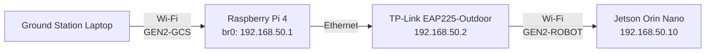

# GEN2 GCS Network

GEN2 로봇의 지상국 노트북과 Jetson을 안정적으로 연결하기 위해 구축한 네트워크입니다.

처음에는 단순히 노트북과 로봇 사이의 Wi-Fi 연결을 개선하려고 시작했습니다. 최종적으로 Raspberry Pi 4를 지상국 측 AP로, TP-Link EAP225-Outdoor를 로봇 측 AP로 사용했습니다.

Raspberry Pi의 `wlan0`와 `eth0`를 `br0`로 묶어서 노트북, Pi, EAP225, Jetson이 모두 `192.168.50.0/24` 하나의 LAN에 있도록 구성했습니다.

이 문서는 제가 실제로 구축하면서 사용한 설정과, 중간에 발생했던 문제 및 해결 방법을 정리한 것입니다.

나중에 동일한 구성을 다시 구축하거나 문제가 생기면 아래 순서대로 확인하면 됩니다.

> 검증 환경: Raspberry Pi OS Lite (Debian 13), kernel 6.18, NetworkManager 1.52.1, dnsmasq 2.91, nftables 1.1.3 / 2026-10-04
>
> 명령어 전체와 단계별 되돌리기는 [docs/full-setup.md](docs/full-setup.md), 기술적인 원본은 [docs/original-runbook.md](docs/original-runbook.md)입니다. README의 명령어는 원본에서 바꾼 것이 없습니다.

---

## 1. 구축한 구조

지상국 노트북과 로봇 사이의 Wi-Fi를 좀 더 안정적으로 만들어야 했습니다. 최종 구조는 이렇습니다.



Pi가 지상국 쪽 Wi-Fi(`GEN2-GCS`)를 만들고, EAP225가 로봇 쪽 Wi-Fi(`GEN2-ROBOT`)를 만듭니다. 두 Wi-Fi는 Pi 안의 브리지 `br0`로 이어져서 전체가 `192.168.50.0/24` LAN 하나입니다.

## 2. 이렇게 구성한 이유

- Pi가 `GEN2-GCS`를 만들고, EAP225가 `GEN2-ROBOT`을 만듭니다.
- `wlan0`와 `eth0`를 `br0`에 묶었습니다. 라우팅하지 않고 L2로 이었습니다.
- 그래서 노트북과 Jetson이 같은 서브넷에 있습니다.
- ROS 2 DDS 멀티캐스트가 그냥 통과합니다. 피어 주소를 수동으로 넣을 필요가 없습니다.
- **로봇 밸런스 제어 루프는 이 Wi-Fi를 쓰지 않습니다.** Jetson 로컬 IMU + CAN으로 돕니다.
- 이 망은 ROS 2 토픽, SSH, 텔레옵, SLAM 시각화, 진단, 카메라 미리보기용입니다.

## 3. 최종 네트워크 설정

| 장비 | 주소 | 역할 |
| --- | --- | --- |
| Raspberry Pi `br0` | `192.168.50.1` | GCS AP / 브리지 / DHCP |
| EAP225-Outdoor | `192.168.50.2` | 로봇 측 AP |
| Jetson Orin Nano | `192.168.50.10` | 로봇 컴퓨터 |
| 노트북 | DHCP (`.100` – `.200`) | 지상국 |

```
GEN2-GCS     Pi wlan0, 2.4 GHz ch 6, WPA2     <- 노트북이 붙음
GEN2-ROBOT   EAP225, WPA2-PSK (AES)           <- Jetson이 붙음
```

IP는 `br0`만 가집니다. `wlan0`와 `eth0`는 주소 없는 브리지 포트입니다. **같은 IP를 `wlan0`나 `eth0`에 주지 마세요.**

## 4. 사용한 하드웨어

- Raspberry Pi 4
- **TP-Link EAP225-Outdoor** (Omada)
- Jetson Orin Nano
- 지상국 노트북
- Ethernet 케이블 (Pi `eth0` ↔ EAP225)
- 각 장비 전원
- 2020 알루미늄 프로파일 (지지대) + 브라켓

선택:

- Android 폰 (USB 테더링용, [9번](#9-선택사항-usb-테더링) 참고)

### 지지대 & 브라켓


Pi 4와 TP-Link EAP225-Outdoor를 2020 프로파일 하나에 같이 세워서 쓴다. 안테나가 위로 올라오게 세우고, Pi는 AP 바로 옆 프로파일에 붙인다.

- 2020 프로파일 지지대와 브라켓 모델은 [Onshape 문서](https://cad.onshape.com/documents/eb8f1ae66d872a8dc34ad04b/w/f149fbaa85f6e4b3bb27186b/e/26e3c731a53e620f67562c44?renderMode=0&uiState=6ac2860149432b68a5bfc669)에서 받아서 쓰면 된다.
- 왼쪽 사진은 전체 모습이다. 프로파일을 세우고 위쪽에 EAP225, 그 옆에 Pi 4를 붙여준다.
- 오른쪽 사진은 옆에서 본 모습이다. EAP225는 브라켓에 끼워서 프로파일에 고정해준다.
- Pi와 EAP225를 잇는 Ethernet 케이블은 남는 길이를 둥글게 말아서 케이블타이로 프로파일에 묶어준다.
- 케이블이 늘어지면 커넥터에 힘이 걸리니까, 묶을 때는 `eth0` 쪽 커넥터에 장력이 안 걸리게 해준다.
- 다 고정했으면 Pi와 EAP225 전원을 넣고, 아래 구축 순서 Step 1부터 입력하자.

## 5. 구축 순서

순서대로 하면 됩니다. 각 단계의 **명령어, 기대 출력, 통과 조건, 되돌리기**는 [docs/full-setup.md](docs/full-setup.md)에 있습니다. 여기서는 각 단계에서 뭘 했고 뭘 조심해야 하는지만 적었습니다.

| Step | 한 일 | 핵심 |
| --- | --- | --- |
| 1 | 현재 네트워크 확인 + 백업 | 바꾸기 전에 읽기만 합니다. `scripts/backup-network.sh`로 백업합니다. |
| 2 | `br0` 만들기 | `192.168.50.1`은 `br0`만 가집니다. 수동 IP, STP 끔. |
| 3 | DHCP 설정 | DHCP는 dnsmasq 하나만. NM `shared` 모드는 쓰지 않습니다. |
| 4 | `GEN2-GCS` 만들기 | Wi-Fi 국가코드 KR 설정 후 `wlan0`를 AP로. PSK는 `psk-flags 0`으로 저장. |
| 5 | `eth0`를 `br0`에 넣기 | `GEN2-GCS`가 되는 걸 확인한 뒤에 합니다. SSH 경고, 3분 자동 롤백. |
| 6 | EAP225 설정 | `192.168.50.2` 고정, `GEN2-ROBOT`, Client Isolation / Portal / VLAN 모두 OFF. |
| 7 | Jetson 설정 | `GEN2-ROBOT`에 `192.168.50.10` 고정, Wi-Fi 절전 끔. |
| 8 | 검증 | 노트북에서 `.1`, `.2`, `.10` ping + ROS 2 토픽. |
| 9 | 점검 스크립트 + 재부팅 테스트 | `gcs-netcheck.sh`가 `ALL OK`. |

### 꼭 기억할 것

1. **백업 먼저.** 기존 프로필은 지우지 말고 `connection.autoconnect no`로 끄세요. 되돌릴 때 다시 켜면 됩니다.
2. **SSH 경고.** 지금 SSH가 `eth0`로 들어와 있다면 Step 5에서 끊길 수 있습니다. 로컬 콘솔이나 `GEN2-GCS`(wlan0) 경로로 접속한 상태에서 하세요. `wlan0`와 `eth0`를 동시에 내리지 마세요.
3. **자동 롤백.** Step 5는 3분 뒤 이전 프로필로 돌아가는 타이머를 걸고 시작합니다. 문제없으면 3분 안에 `sudo systemctl stop eth0-rollback.timer`로 취소합니다.
4. **EAP225 주소가 바뀝니다.** `eth0`가 브리지에 붙으면 EAP가 DHCP로 `.100–.200` 중 하나를 받아 가서 `192.168.0.254`로는 더 이상 안 들어가집니다. Pi에서 `cat /var/lib/misc/dnsmasq.leases`로 찾으면 됩니다.
5. **비밀번호는 `read -s`로 입력.** 채팅이나 공유 문서에 붙여넣지 마세요.

### 점검 스크립트와 재부팅 테스트

Pi에 [scripts/gcs-netcheck.sh](scripts/gcs-netcheck.sh)를 복사해서 돌립니다. 읽기 전용이고 종료 코드가 FAIL 개수입니다. 부팅 후, 폰을 꽂고 뺀 뒤, 현장 투입 전에 한 번씩 돌립니다.

```bash
~/gcs-netcheck.sh
```

마지막 줄이 `ALL OK`면 통과입니다. `WARN`은 실패가 아니라 아직 안 끝난 항목입니다 (예: Jetson 설정 전).

그다음 `sudo reboot` 하고 1분쯤 뒤에 다시 돌립니다. 손대지 않은 상태에서 `ALL OK`가 나와야 합니다. 안 되면 아래를 확인합니다.

```bash
sudo journalctl -b -u NetworkManager -u dnsmasq --no-pager | tail -80
```

## 6. 실제로 겪은 문제

구축하면서 실제로 겪은 것들입니다. 표로 된 전체 목록은 [docs/troubleshooting.md](docs/troubleshooting.md)에 있습니다.

### GEN2-GCS가 재부팅 후 안 올라옴

- **원인**: Wi-Fi PSK가 프로필에 저장되지 않았습니다.
- **로그**: `secrets are required` / `no-secrets`
- **해결**: `read -s`로 비밀번호를 입력하고 `psk-flags 0`으로 저장했습니다. `sudo grep -c '^psk=' /etc/NetworkManager/system-connections/GEN2-GCS.nmconnection`이 `1`인지 확인합니다. ([full-setup.md](docs/full-setup.md) Step 4)

### dnsmasq가 Address already in use로 죽음

- **원인**: NetworkManager shared 모드의 dnsmasq와 별도의 dnsmasq가 DHCP를 같이 잡으려고 했습니다. shared 프로필 두 개가 `192.168.50.1`을 같이 가진 경우도 같은 증상입니다.
- **해결**: DHCP 서버를 하나만 씁니다. `robot-br`를 `ipv4.method manual`로 바꾸고, `pgrep -a dnsmasq`가 `/usr/sbin/dnsmasq -x /run/dnsmasq/…` 한 줄만 나오는지 확인합니다.

### EAP225가 192.168.0.254에서 사라짐

- **원인**: `eth0`가 `br0`에 들어가자 EAP가 새 DHCP 네트워크에서 주소를 받아 갔습니다.
- **해결**: `cat /var/lib/misc/dnsmasq.leases`로 찾고, MAC 예약 + `192.168.50.2` 고정을 합니다. ([full-setup.md](docs/full-setup.md) Step 6)

### 재부팅 후 eth0가 DHCP 클라이언트로 돌아옴

- **원인**: `interface-name`이 비어 있는 다른 프로필(`netplan-eth0`)이 모든 유선 장치에 매칭되면서 `eth0`를 가로챘습니다.
- **해결**: 그 프로필의 `autoconnect`를 끄고(삭제 안 함), `robot-eth`를 브리지 포트로 두고 우선순위 10을 확인했습니다.

  ```bash
  sudo nmcli connection modify netplan-eth0 connection.autoconnect no
  ```

### ping이 갑자기 50-200 ms로 튐

- **원인**: Wi-Fi 절전(power saving).
- **해결**: Jetson/클라이언트 쪽에서 절전을 끕니다. Jetson은 `802-11-wireless.powersave 2`, Linux 노트북도 동일합니다. Pi AP 쪽은 해당 없습니다.

## 7. ROS 2 확인

노트북에서 `.1`, `.2`, `.10`이 모두 ping 되면 ROS 2를 확인합니다. 양쪽 모두 같은 도메인 ID를 쓰고 `ROS_LOCALHOST_ONLY`는 꺼 둡니다.

```bash
export ROS_DOMAIN_ID=20
unset ROS_LOCALHOST_ONLY
```

Jetson:

```bash
ros2 topic pub /network_test std_msgs/msg/String "{data: 'hello'}" -r 2
```

노트북:

```bash
ros2 topic echo /network_test
```

`data: hello`가 계속 올라오면 됩니다. 폰 테더링을 뽑은 상태에서도 계속 보여야 합니다. 안 보이면 [docs/ros2-test.md](docs/ros2-test.md)를 보세요.

## 8. 성능 측정

**아직 측정값을 채우지 못했습니다.** 측정하지 않은 값은 임의로 채우지 않았습니다. 구축 당시 기록은 Pi ↔ EAP(유선) ping 0.2–0.6 ms뿐입니다.

| 구간 | Avg RTT | Max RTT | Packet Loss |
| --- | ---: | ---: | ---: |
| 노트북 ↔ Pi | — | — | — |
| Pi ↔ Jetson | — | — | — |
| 노트북 ↔ Jetson | — | — | — |

측정 방법(`ping`, `iperf3`)은 [docs/ros2-test.md](docs/ros2-test.md)에, 거리·환경별 현장 테스트 기록 양식은 [docs/field-test.md](docs/field-test.md)에 있습니다. 무선 클라이언트에서 max RTT가 100 ms를 넘게 튀면 대부분 클라이언트 Wi-Fi 절전 때문이었습니다.

### 지금까지 확인한 것과 비어 있는 것

- 확인함: 2026-10-04 `gcs-netcheck.sh` 실측에서 LAN 항목 전부 PASS, 폰 테더링 인터넷 PASS, 노트북 2대가 `GEN2-GCS`에 접속. 이때는 **Jetson 설정 전**이라 EAP225는 `.200`에 있었고(WARN), Jetson `.10`은 응답 없음(WARN)이었습니다.
- 런북에 결과가 기록돼 있지 않음: Jetson 연결 이후의 ROS 2 멀티캐스트 테스트 결과, 위 성능 측정표의 값, 거리별 테스트.

## 9. 선택사항: USB 테더링

**이건 선택사항입니다. 로봇 네트워크 자체는 인터넷 없이 동작합니다.** 폰이 없으면 인터넷만 안 되고, 노트북 ↔ Pi ↔ EAP ↔ Jetson 통신과 ROS 2는 그대로입니다. 이 시스템의 목적은 인터넷 공유가 아닙니다.


제가 구성하고 확인한 방식만 적습니다.

- 안드로이드 폰을 Pi에 USB로 꽂고 USB 테더링을 켭니다. Pi에서는 `usb0` 또는 `enx...`로 보입니다.
- `wan-tether` 프로필이 `usb* enx*`에만 붙어서 폰에게서 DHCP로 주소를 받습니다 (`route-metric 100`).
- `br0`에서 테더링으로 나가는 트래픽만 NAT(masquerade) 합니다. 폰 쪽에서 LAN으로 새로 들어오는 연결은 막습니다.
- 브리지 안의 L2 트래픽(ROS 2 멀티캐스트 포함)은 이 규칙을 거치지 않습니다.
- dnsmasq가 게이트웨이로 Pi(`.1`)를 줘서 노트북과 Jetson이 Pi를 통해 인터넷에 나갑니다.

`wan-tether` 프로필, NAT/포워딩 설정, 되돌리기 명령은 [docs/full-setup.md](docs/full-setup.md)의 Step 10–11에 있습니다. 설정 파일 예시는 [config/examples/](config/examples/)에 있습니다. 인터넷 공유를 안 쓸 거라면 Step 3의 dnsmasq 설정에서 게이트웨이/DNS 줄을 줄이고 Step 10–11은 건너뜁니다.

---

## 처음부터 전부 되돌리기

Step 1 백업으로 돌립니다. **로컬 콘솔에서 실행하세요** (Wi-Fi 경로가 끊길 수 있습니다). 명령어는 [docs/full-setup.md](docs/full-setup.md) 맨 아래 "전체 되돌리기"에 있습니다.

## 저장소 구성

```
GEN2-GCS-Network/
├── README.md
├── docs/
│   ├── images/                 # 장비 설치 사진
│   ├── full-setup.md           # 명령어 전체 + 통과 조건 + 되돌리기 + 인터넷 공유
│   ├── troubleshooting.md      # 증상 표 + 로그 확인 명령
│   ├── ros2-test.md            # ROS 2 확인 + 성능 측정 방법
│   ├── field-test.md           # 현장 테스트 기록 양식
│   └── original-runbook.md     # 원본 런북 (기술적 기준)
├── scripts/
│   ├── gcs-netcheck.sh         # Pi에서 돌리는 상태 점검
│   └── backup-network.sh       # 바꾸기 전에 Pi 설정 백업
└── config/
    └── examples/               # dnsmasq / nftables / sysctl 예시
```

이 저장소에는 실제 Wi-Fi 비밀번호(PSK)나 `.nmconnection` 파일을 올리지 않습니다. `config/examples/`의 MAC 주소도 예시 값입니다.
