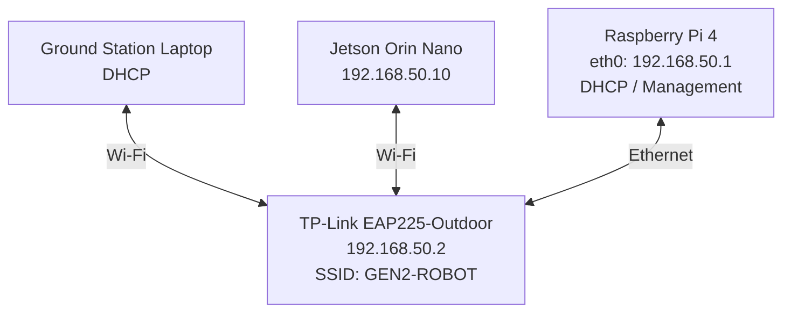
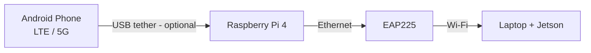

# GEN2 GCS Network

로봇과 지상국 컴퓨터를 보다 안정적인 Wi-Fi로 연결하기 위해 구축한 네트워크.

EAP225-Outdoor를 메인 AP로 사용해 지상국 노트북과 로봇을 하나의 무선 LAN에 연결하고자 함.

최종 구성에서는 지상국 노트북과 Jetson이 모두 같은 SSID에 직접 접속.

Raspberry Pi 4는 EAP225에 이더넷으로 연결되어 `192.168.50.1`을 사용하고, DHCP와 네트워크 관리, 필요할 경우 Android USB 테더링을 통한 인터넷 공유 역할만 담당.

이 문서는 필자가 실제로 구축한 구성과 설정 순서, 구축 과정에서 확인한 문제와 해결 방법을 정리한 문서.

> 명령어 전체와 단계별 되돌리기는 [docs/full-setup.md](docs/full-setup.md)에 있으니, 이 페이지를 먼저 읽고 접속해서 따라하자.

---

## 1. 구축한 구조

EAP225 하나에 노트북과 Jetson을 둘 다 연결했다. Pi는 Wi-Fi AP로 쓰지 않고 이더넷으로 EAP에 연결.



**EAP225가 메인 AP이고, 노트북과 로봇이 둘 다 `GEN2-ROBOT`에 붙음. Pi는 유선으로 연결해서 DHCP와 관리 역할만 함.**

## 2. 이렇게 구성한 이유

- 노트북과 Jetson이 같은 EAP에 붙으니 같은 `192.168.50.0/24`에 있음.
- ROS 2 트래픽이 Pi의 Wi-Fi–Ethernet 브리지를 거치지 않음. `노트북 → EAP → Jetson` 구조.
- Pi는 Wi-Fi를 제공하지 않고, DHCP, 네트워크 관리, 진단, 인터넷 게이트웨이만 맡음.

## 3. 최종 네트워크 설정

나의 세팅이니 SSID와 IP는 필요에 맞게 수정해서 쓰자.

| 장비 | 주소 | 역할 |
| --- | --- | --- |
| Raspberry Pi 4 (`eth0`) | `192.168.50.1` | DHCP / 게이트웨이 / 관리 |
| EAP225-Outdoor | `192.168.50.2` | 메인 AP (노트북 + Jetson) |
| Jetson Orin Nano | `192.168.50.10` | 로봇 컴퓨터 |
| 노트북 | DHCP (`.100` – `.200`) | 지상국 |

`.1`, `.2`, `.10`은 DHCP 대역(`.100`–`.200`) 밖에 있음. Pi는 `eth0`가 `192.168.50.1/24`를 직접 가짐.

## 4. 사용한 하드웨어

- Raspberry Pi 4
- **TP-Link EAP225-Outdoor** (Omada)
- 이더넷 케이블 (Pi `eth0` ↔ EAP225)
- PoE(Power over Ethernet) 인젝터 (EAP225 구매 시 동봉. 배터리로 쓰려면 개조가 필요함)
- 2020 알루미늄 프로파일 (지지대) + 브라켓

선택:

- Android 폰, USB 케이블 (A–C) (USB 테더링용, [6번](#6-선택사항-usb-테더링) 참고)

### 지지대 & 브라켓


- 2020 프로파일 지지대와 브라켓 모델은 [Onshape 문서](https://cad.onshape.com/documents/eb8f1ae66d872a8dc34ad04b/w/f149fbaa85f6e4b3bb27186b/e/26e3c731a53e620f67562c44?renderMode=0&uiState=6ac2860149432b68a5bfc669)에서 받아서 쓰자.
- 왼쪽 사진은 전체 모습, 오른쪽 사진은 옆에서 본 모습.

## 5. 구축 순서

순서대로 하면 된다. 각 단계의 **명령어, 통과 조건, 되돌리기**는 [docs/full-setup.md](docs/full-setup.md)에 있으니 참고하자. 여기서는 각 단계에서 뭘 했고 뭘 조심해야 하는지만 적음. 막히면 [docs/troubleshooting.md](docs/troubleshooting.md)를 먼저 보고, 그래도 안 되면 AI나 에이전트의 도움을 받자.

| Step | 한 일 | 핵심 |
| --- | --- | --- |
| 1 | 현재 네트워크 확인 + 백업 | 바꾸기 전에 읽기만 함. `scripts/backup-network.sh`로 백업. |
| 2 | Pi `eth0`에 `192.168.50.1/24` 주기 | 수동 IP, 기본 경로 없음. SSH 경고, 3분 자동 롤백. |
| 3 | DHCP 설정 (dnsmasq) | DHCP는 dnsmasq 하나만, `interface=eth0`. NM `shared` 모드는 쓰지 않음. |
| 4 | EAP225 설정 | `192.168.50.2` 고정, SSID `GEN2-ROBOT`, Client Isolation / Portal / VLAN 모두 OFF. |
| 5 | Jetson 설정 | `GEN2-ROBOT`에 `192.168.50.10` 고정, Wi-Fi 절전 끔. |
| 6 | 노트북 접속 + 검증 | 노트북도 `GEN2-ROBOT`. `.1`, `.2`, `.10` ping, Jetson SSH, ROS 2 ([docs/ros2-test.md](docs/ros2-test.md)). |
| 7 | 점검 스크립트 + 재부팅 테스트 | `gcs-netcheck.sh`가 `ALL OK`. |

### 점검 스크립트와 재부팅 테스트

Pi에 [scripts/gcs-netcheck.sh](scripts/gcs-netcheck.sh)를 복사해서 돌리자. 읽기 전용이고 종료 코드가 FAIL 개수. 부팅 후, 폰을 꽂고 뺀 뒤, 현장 투입 전에 한 번씩 돌림.

```bash
~/gcs-netcheck.sh
```

마지막 줄이 `ALL OK`면 통과. `WARN`은 실패가 아니라 아직 안 끝난 항목 (예: Jetson 설정 전, 폰 없음).

그다음 `sudo reboot` 하고 1분쯤 뒤에 다시 돌림. 손대지 않은 상태에서 `ALL OK`가 나와야 함. 안 되면 아래 로그를 확인하고 트러블슈팅.

```bash
sudo journalctl -b -u NetworkManager -u dnsmasq --no-pager | tail -80
```

성능 측정은 [docs/performance.md](docs/performance.md)에 방법만 있고, 측정값은 아직 비어 있음.

## 6. 선택사항: USB 테더링

**이건 선택사항. 로봇 네트워크 자체는 인터넷 없이 동작함.** 폰이 없으면 인터넷만 안 되고, 노트북 ↔ Jetson, 노트북 ↔ Pi, 노트북 ↔ EAP 통신과 ROS 2는 그대로. 이 시스템의 목적은 인터넷 공유가 아님.



- 안드로이드 폰을 Pi에 USB로 꽂고 USB 테더링을 켠다. Pi에서는 `usb0` 또는 `enx...`로 보임.
- `wan-tether` 프로필이 `usb* enx*`에만 붙어서 폰에게서 DHCP로 주소를 받는다 (`route-metric 100`).
- `eth0`(LAN)에서 테더링으로 나가는 트래픽만 NAT(masquerade) 한다. 폰 쪽에서 LAN으로 새로 들어오는 연결은 막음.
- dnsmasq가 게이트웨이로 Pi(`.1`)를 줘서 노트북과 Jetson이 Pi를 통해 인터넷에 나감.

`wan-tether` 프로필, NAT/포워딩 설정, 되돌리기 명령은 [docs/full-setup.md](docs/full-setup.md)의 Step 8–9에 있음. 설정 파일 예시는 [config/examples/](config/examples/)에 있음. 인터넷 공유를 안 쓸 거라면 Step 3의 dnsmasq 설정에서 게이트웨이/DNS 줄을 `dhcp-option=option:router` 한 줄로 줄이고 Step 8–9는 건너뛰자.

## 7. 처음부터 전부 되돌리기

Step 1 백업으로 돌리기. **Pi의 로컬 콘솔에서 실행할 것!** (네트워크 경로가 끊길 수 있음). 명령어는 [docs/full-setup.md](docs/full-setup.md) 맨 아래 "전체 되돌리기"에 있다.

## 저장소 구성

```
GEN2-GCS-Network/
├── README.md
├── docs/
│   ├── full-setup.md           # 명령어 전체 + 통과 조건 + 되돌리기 + 인터넷 공유
│   ├── troubleshooting.md      # 증상별 확인 + 겪은 문제
│   ├── ros2-test.md            # ROS 2 확인
│   ├── performance.md          # 성능 측정 방법 + 기록표
│   ├── field-test.md           # 현장 테스트 기록 양식
│   └── archive/
│       └── runbook.md          # 원본 형식의 한 페이지 런북
├── scripts/
│   ├── gcs-netcheck.sh         # Pi에서 돌리는 상태 점검
│   └── backup-network.sh       # 바꾸기 전에 Pi 설정 백업
├── config/
│   └── examples/               # dnsmasq / nftables / eth0 프로필 예시
└── images/                     # 장비 설치 사진
```
