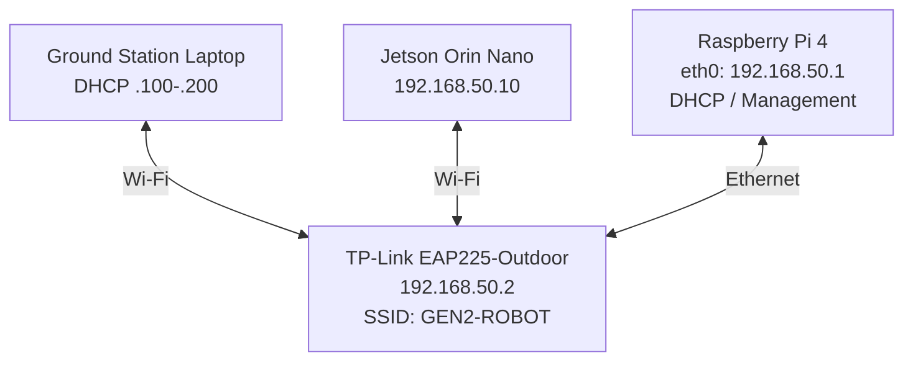
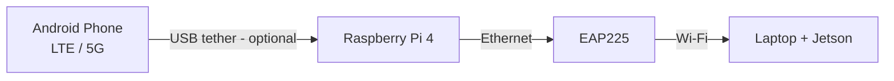

# 런북 (원본 형식, 한 페이지)

EAP225 하나에 노트북과 Jetson이 둘 다 `GEN2-ROBOT`으로 붙고, Pi는 이더넷으로 EAP에 연결되어 `eth0`가 `192.168.50.1/24`를 가지는 구성을 위에서부터 순서대로 따라 하는 런북. 각 단계의 통과 조건을 확인한 뒤 다음 단계로 넘어갈 것. 설명은 [full-setup.md](../full-setup.md)와 같은 내용이고, 이 문서에는 문제 해결 표와 이력까지 한 페이지에 모아 둠.



명령어 앞에 `Pi:`, `노트북:`, `Jetson:`이 붙어 있으면 그 장비에서 실행하는 것임.

> **이 문서의 명령어에 대해.** Wi-Fi/EAP/Jetson/dnsmasq/백업/점검 스크립트 명령은 이전 구성(브리지 방식)에서 검증한 런북 기준임. `eth0`에 IP를 직접 주는 프로필(Step 2)과 nftables의 LAN 쪽 인터페이스(`eth0`)는 새 구성에 맞게 바꾼 부분임. 새 구성의 실측 결과는 아직 기록하지 않았음.

---

## Step 1. 현재 네트워크 확인 & 백업

인터페이스 이름과 프로필 이름은 Pi마다 다름. 짐작하지 말고 먼저 읽을 것. 이 단계에서는 아무것도 바꾸지 않음.

Pi:

```bash
nmcli device status
nmcli connection show
ip -br addr
ip route
sysctl net.ipv4.ip_forward
systemctl status dnsmasq --no-pager
sudo nft list ruleset
pgrep -a dnsmasq
who    # 내 SSH가 어느 IP로 들어와 있는지 확인
```

저는 **어떤 프로필이 `eth0`를 잡고 있는지** 먼저 확인했음. 특히 아래 세 가지를 메모해 둠. 뒤 단계에서 정리함.

- `ipv4.method shared`인 프로필
- 같은 장치(`eth0`)에 자동연결이 켜진 프로필이 여러 개인 경우
- `interface-name`이 비어 있는 ethernet 프로필 (예: `netplan-eth0`, 모든 유선 장치에 매칭됨)

백업 ([scripts/backup-network.sh](../../scripts/backup-network.sh)와 같은 내용):

```bash
B=~/netbackup-$(date +%Y%m%d)-pre; mkdir -p $B
sudo cp -a /etc/NetworkManager $B/etc-NetworkManager
sudo cp -a /run/NetworkManager/system-connections $B/run-nm-system-connections 2>/dev/null
sudo cp -a /etc/netplan $B/etc-netplan
sudo cp -a /etc/dnsmasq.d $B/etc-dnsmasq.d 2>/dev/null
sudo cp -a /etc/sysctl.d $B/sysctl.d
sudo cp -a /etc/nftables.conf $B/nftables.conf.orig 2>/dev/null
sudo nft list ruleset > $B/nft-ruleset.txt
{ nmcli connection show; nmcli device status; ip -br addr; ip route; } > $B/state.txt
sudo chown -R $USER: $B; chmod -R go-rwx $B; ls $B
```

**기존 프로필은 지우지 않음.** 삭제하지 말고 `connection.autoconnect no`로 끔. 되돌릴 때 다시 켜면 됨.

**통과 조건:** 각 인터페이스의 역할(어느 것이 SSH 경로인지, 폰이 `usb0`인지 `enx…`인지)을 파악했고, 백업 폴더 `~/netbackup-YYYYMMDD-pre`가 생겼음.

---

## Step 2. Pi `eth0`에 192.168.50.1 주기

브리지는 없음. `eth0`가 LAN 주소를 직접 가짐. 수동 IP, 기본 경로 없음(`never-default`). 프로필 예시는 [config/examples/raspberry-pi-eth0.md](../../config/examples/raspberry-pi-eth0.md)에도 있음.

> **SSH 경고.** 지금 SSH가 `eth0`로 들어와 있다면 이 단계에서 끊김. 로컬 콘솔이나 다른 경로로 접속한 상태에서 할 것.

> **이전 구성(Pi AP + 브리지)을 해본 Pi라면**: `GEN2-GCS`, `robot-br`, `robot-eth` 프로필이 남아 있을 수 있음. 지우지 말고 자동연결만 끌 것. `robot-eth`가 켜져 있으면 `eth0`를 브리지 포트로 잡아 버림.
>
> ```bash
> for c in GEN2-GCS robot-br robot-eth; do sudo nmcli connection modify "$c" connection.autoconnect no 2>/dev/null; done
> ```

지금 `eth0`를 잡고 있는 프로필 확인:

```bash
nmcli -f NAME,TYPE,DEVICE,AUTOCONNECT,AUTOCONNECT-PRIORITY connection show
nmcli -g GENERAL.CONNECTION device show eth0     # 지금 eth0를 잡고 있는 프로필 이름
```

`eth0` 프로필 만들기 (프로필 이름 `gcs-lan`은 이 저장소에서 새로 만드는 이름임):

```bash
sudo nmcli connection add type ethernet con-name gcs-lan ifname eth0 \
  ipv4.method manual ipv4.addresses 192.168.50.1/24 ipv4.never-default yes \
  ipv6.method disabled connection.autoconnect yes connection.autoconnect-priority 10
```

이미 있다면 `add` 대신 `modify`로 같은 값을 맞춤. 특히 `ipv4.method`가 `shared`였다면 `manual`로 바꿈.

**3분 자동 롤백을 걸고** 전환함. 제 경우 `eth0`를 잡고 있던 프로필은 `eap-mgmt`였음. 본인 Pi의 이름으로 바꿀 것.

```bash
OLD='eap-mgmt'   # 위에서 확인한, 현재 eth0를 잡고 있던 프로필 이름
sudo systemd-run --on-active=180 --unit=eth0-rollback /bin/sh -c \
  "nmcli con mod '$OLD' connection.autoconnect yes; nmcli con up '$OLD'"
sudo nmcli connection modify "$OLD" connection.autoconnect no
sudo nmcli connection up gcs-lan
```

확인:

```bash
ip -br addr show eth0              # 192.168.50.1/24
nmcli device status                # eth0 = gcs-lan
pgrep -a dnsmasq || echo "dnsmasq 없음"
sudo nft list ruleset              # 비어 있어야 함 (nm-shared 테이블 없음)
```

문제없으면 3분 안에 타이머를 취소함.

```bash
sudo systemctl stop eth0-rollback.timer
```

**통과 조건:** `192.168.50.1`을 가진 인터페이스가 `eth0` 하나뿐이고, NM이 띄운 dnsmasq나 `nm-shared-*` nft 테이블이 없음.

**되돌리기:** 타이머를 취소하지 않으면 3분 뒤 이전 프로필로 자동 복귀함. 이미 취소했다면 `sudo nmcli connection modify "$OLD" connection.autoconnect yes; sudo nmcli connection delete gcs-lan; sudo nmcli connection up "$OLD"`.

---

## Step 3. DHCP 설정 (dnsmasq)

처음에는 NetworkManager의 shared 모드로 구성했는데, dnsmasq와 충돌하면서 `Address already in use`가 발생했음. 그래서 최종 구성에서는 `eth0`에는 수동 IP만 주고 **DHCP는 dnsmasq 하나만** 사용함. NM의 `ipv4.method shared`는 쓰지 않음.

DHCP만 켜고 DNS는 끔(`port=0`). 클라이언트에게 게이트웨이로 Pi(`.1`)를, DNS로 공용 DNS를 줌. `bind-dynamic` 덕분에 부팅 때 `eth0`가 늦게 올라와도 dnsmasq가 실패하지 않음. 고정 주소(`.1`, `.2`, `.10`)는 DHCP 대역(`.100–.200`) 밖에 있음.

패키지 설치에 인터넷이 필요함. 폰을 USB로 꽂고 USB 테더링을 켜면 Pi 자신은 바로 인터넷이 됨. 설정 파일을 **먼저 쓰고** 설치해야 기본 설정으로 잠깐 떴다가 포트 충돌이 나는 일이 없음.

Pi (예시 파일: [config/examples/dnsmasq.conf](../../config/examples/dnsmasq.conf)):

```bash
sudo mkdir -p /etc/dnsmasq.d
sudo tee /etc/dnsmasq.d/gcs-lan.conf >/dev/null <<'EOF'
# GEN2 ground-station LAN: DHCP only on eth0 (Pi is gateway; NAT via USB tether in nftables)
interface=eth0
bind-dynamic
port=0
dhcp-authoritative
dhcp-range=192.168.50.100,192.168.50.200,255.255.255.0,12h
dhcp-option=option:router,192.168.50.1
dhcp-option=option:dns-server,1.1.1.1,8.8.8.8
EOF
sudo DEBIAN_FRONTEND=noninteractive apt-get install -y dnsmasq
sudo systemctl enable --now dnsmasq
```

확인:

```bash
systemctl is-active dnsmasq
sudo journalctl -u dnsmasq -n 6 --no-pager
sudo ss -lunp | grep ':67 '     # 딱 한 줄
```

기대 결과 (형식 예시): `active`, 로그에 `DNS disabled`, `DHCP, IP range 192.168.50.100 -- 192.168.50.200, lease time 12h`, `sockets bound exclusively to interface eth0`, 그리고 `:67`을 듣는 줄이 dnsmasq 하나.

**인터넷 공유를 안 쓸 거라면** 마지막 두 줄(`router`, `dns-server`)을 `dhcp-option=option:router` 한 줄로 바꿀 것. 게이트웨이를 주지 않으니 노트북 기본 경로가 Pi로 잡히지 않음. 이 경우 Step 8–9는 건너뜀.

**통과 조건:** 67번 포트(DHCP)를 듣는 프로세스가 dnsmasq 하나뿐임.

**되돌리기:** `sudo systemctl disable --now dnsmasq; sudo rm /etc/dnsmasq.d/gcs-lan.conf`

---

## Step 4. EAP225 설정

EAP225가 노트북과 Jetson이 **둘 다** 붙는 메인 AP임. SSID는 `GEN2-ROBOT` 하나만 씀. EAP는 AP 역할만 함(DHCP, NAT 없음).

**EAP의 주소를 찾음.** EAP225가 공장 기본(DHCP) 모드라면 Pi의 `eth0`에 연결되는 순간 dnsmasq에서 `.100–.200` 중 하나를 받아 감. 이전 기본 주소 `192.168.0.254`로는 접속되지 않을 수 있음.

Pi:

```bash
cat /var/lib/misc/dnsmasq.leases | grep -i eap
# 예: 1791167945 aa:bb:cc:dd:ee:ff 192.168.50.200 EAP225-Outdoor-AA-BB-CC-DD-EE-FF 01:aa:bb:cc:dd:ee:ff
#                └ MAC 주소             └ 지금 주소
```

설정이 풀려도 같은 주소를 받도록 dnsmasq에 MAC 예약을 걸어 둠. MAC은 위 출력의 값으로 바꿀 것.

```bash
EAP_MAC='aa:bb:cc:dd:ee:ff'   # 위 leases 출력의 MAC으로 바꾸기
printf '%s\n' '# Reserved: EAP225-Outdoor management' "dhcp-host=$EAP_MAC,192.168.50.2,eap225" \
  | sudo tee -a /etc/dnsmasq.d/gcs-lan.conf
sudo dnsmasq --test -C /dev/null -7 /etc/dnsmasq.d && sudo systemctl restart dnsmasq
```

처음에는 `GEN2-ROBOT`이 아직 없어서 노트북이 EAP와 같은 LAN에 없음. Pi에 SSH로 들어갈 수 있는 기존 경로가 있다면 Pi를 거치는 SSH 터널로 EAP 웹 UI에 접속함. (leases에 보인 주소가 `192.168.50.200`이라면 아래 터널의 `192.168.0.254`를 그 주소로 바꿈.) 노트북이 이미 EAP와 같은 LAN에 있다면 `https://<leases에 보인 주소>`로 바로 접속하면 됨. 새 구성에서 이 첫 접속을 어떻게 했는지는 기록이 없어서, 환경에 맞게 할 것.

EAP 웹 UI 설정:

| 항목 | 값 |
| --- | --- |
| IP 설정 | Static · `192.168.50.2` · `255.255.255.0` |
| Gateway / DNS | `192.168.50.1` / `8.8.8.8` (Pi는 DNS를 제공하지 않음) |
| SSID | `GEN2-ROBOT`, WPA2-PSK (AES) |
| Client Isolation | **OFF** |
| Portal | **OFF** |
| VLAN / Management VLAN | **OFF** |
| 멀티캐스트 필터 계열 옵션 | 있다면 **OFF** (ROS 2 디스커버리가 멀티캐스트를 씀) |

중요한 조건은 하나임. **노트북과 Jetson이 EAP를 통해 서로 직접 통신할 수 있어야 함.** 그래서 Client Isolation, VLAN, 멀티캐스트 필터를 끔. SSID는 `GEN2-ROBOT` 하나만 만듬.

**EAP가 `192.168.0.254`에 남아 있다면** (고정 IP로 설정돼 있던 경우) Pi에 임시 주소를 붙여 접속함. 이 주소는 재부팅하면 사라짐.

```bash
sudo ip addr add 192.168.0.10/24 dev eth0                      # Pi
ssh -L 8443:192.168.0.254:443 <pi-user>@<pi-접속-주소>          # 노트북. 이후 브라우저로 https://localhost:8443
sudo ip addr del 192.168.0.10/24 dev eth0                      # 설정 끝나고 Pi에서
```

확인 (Pi에서):

```bash
ping -c 3 192.168.50.2
```

**통과 조건:** Pi에서 `192.168.50.2`가 응답하고, EAP UI에서 `GEN2-ROBOT`이 송출 중임.

**되돌리기:** EAP 리셋 버튼으로 공장 초기화하면 DHCP 모드로 돌아가 dnsmasq에서 다시 주소를 받음(예약이 있으면 `.2`).

---

## Step 5. Jetson 설정

Jetson도 노트북과 같은 `GEN2-ROBOT`에 붙임. 고정 IP `192.168.50.10`을 주고, 로봇 통신용 망이라 Wi-Fi 절전을 끔. 절전을 끄면 RTT가 수십~수백 ms씩 튀는 현상이 사라짐.

Orin Nano의 Wi-Fi 이름은 `wlan0`가 아니라 `wlP1p1s0` 같은 형태일 수 있으니 먼저 확인함.

Jetson:

```bash
nmcli device status | grep wifi
```

프로필 생성 (이미 있으면 `add` 대신 `modify`). `802-11-wireless.powersave 2`가 Wi-Fi 절전을 끄는 설정임. 게이트웨이/DNS는 인터넷 공유를 쓸 때만 필요하지만, 넣어 둬도 LAN 통신에는 영향이 없음.

```bash
IF=wlan0    # 위에서 확인한 Wi-Fi 인터페이스 이름
sudo nmcli connection add type wifi con-name GEN2-ROBOT ifname $IF ssid GEN2-ROBOT \
  wifi-sec.key-mgmt wpa-psk \
  ipv4.method manual ipv4.addresses 192.168.50.10/24 ipv4.gateway 192.168.50.1 ipv4.dns 8.8.8.8 \
  ipv6.method disabled 802-11-wireless.powersave 2 connection.autoconnect yes
read -rsp 'GEN2-ROBOT 비밀번호: ' P; echo
sudo nmcli connection modify GEN2-ROBOT wifi-sec.psk "$P" wifi-sec.psk-flags 0; unset P
sudo nmcli connection up GEN2-ROBOT
iw dev $IF get power_save      # Power save: off
```

비밀번호는 채팅이나 공유 문서에 붙여넣지 말 것. `read -s`로 터미널에서 직접 입력함.

**통과 조건:** `iw dev $IF get power_save`가 `off`이고, Pi에서 `ping -c 3 192.168.50.10`이 됨.

**되돌리기:** `sudo nmcli connection delete GEN2-ROBOT` (Jetson에서 새로 만든 프로필일 때)

---

## Step 6. 노트북 접속 & 검증

노트북도 `GEN2-ROBOT`에 접속함. 접속하면 dnsmasq에서 `192.168.50.100–200` 주소를 받아서 바로 Jetson과 통신할 수 있음.

노트북:

```bash
ipconfig getifaddr en0        # macOS. Linux는 ip -br addr
ping -c 5 192.168.50.1        # Pi
ping -c 5 192.168.50.2        # EAP225
ping -c 5 192.168.50.10       # Jetson
ssh <jetson-user>@192.168.50.10
```

세 곳 모두 응답해야 함. Pi에서 `cat /var/lib/misc/dnsmasq.leases`에 노트북이 보임. macOS는 폰 테더링이 없으면 "인터넷 연결 없음"으로 보일 수 있는데, LAN은 정상임.

그다음 ROS 2 확인은 [ros2-test.md](../ros2-test.md)를 따름.

**통과 조건:** 노트북에서 `.1`, `.2`, `.10` 모두 응답하고 Jetson에 SSH가 됨. ROS 2 토픽이 보임.

---

## Step 7. 점검 스크립트 & 재부팅 테스트

Pi에 [scripts/gcs-netcheck.sh](../../scripts/gcs-netcheck.sh)를 복사해서 돌림. 읽기 전용이고 종료 코드가 FAIL 개수임. 부팅 후, 폰을 꽂고 뺀 뒤, 현장 투입 전에 한 번씩 돌림.

노트북에서 복사하고 Pi에서 실행:

```bash
scp scripts/gcs-netcheck.sh <pi-user>@192.168.50.1:~/       # 노트북
~/gcs-netcheck.sh                                           # Pi
```

출력 형식 (예시. 실측값이 아니라 스크립트가 찍는 형식임):

```
== GEN2 LAN (must always work)
  PASS eth0 owns 192.168.50.1/24
  PASS dnsmasq active
  PASS single DHCP server
  PASS NM shared-mode DHCP not running
  PASS EAP225 reachable at 192.168.50.2
  PASS Jetson reachable at 192.168.50.10
   DHCP leases: 1

== Optional Internet (only when phone tether is plugged in)
  WARN phone tether not connected - LAN-only mode, this is OK

ALL OK
```

폰이 꽂혀 있으면 아래 항목이 대신 나옴.

```
  PASS default route via usb0
  PASS ip_forward = 1
  PASS nftables active, NAT loaded
  PASS Internet connectivity
```

`WARN`은 실패가 아니라 아직 안 끝난 항목임(예: Jetson 설정 전). nftables 항목은 `sudo -n`을 쓰기 때문에 Pi에서 sudo가 비밀번호를 물으면 FAIL로 나옴.

**재부팅 테스트.** 부팅 후 `eth0`(`gcs-lan`) → dnsmasq → (폰이 있으면) `wan-tether` DHCP → 기본 경로 → NAT 순으로 자동 복구되어야 함.

```bash
sudo reboot
# 1분쯤 기다린 뒤 다시 접속
~/gcs-netcheck.sh
```

추가 시나리오:

- **폰 없이 부팅**: LAN 항목 모두 PASS, 인터넷 항목은 `LAN-only mode` WARN만.
- **부팅 후 폰 연결**: USB 테더링을 켜고 10초 뒤 다시 실행하면 `default route via usb0`가 PASS.
- **폰 분리**: 노트북 ↔ Jetson ping과 ROS 2 토픽이 끊기지 않아야 함.

**통과 조건:** 재부팅 후 손대지 않은 상태에서 `ALL OK`.

**안 될 때:** [troubleshooting.md](../troubleshooting.md)에서 증상을 찾고, 아래 로그를 확인함.

```bash
sudo journalctl -b -u NetworkManager -u dnsmasq --no-pager | tail -80
```

---

# 선택사항: 인터넷 공유 (USB 테더링)

**선택사항임.** 로봇 네트워크는 이 부분 없이 동작함. 안 쓸 거라면 Step 3의 dnsmasq 설정을 `dhcp-option=option:router` 한 줄 버전으로 쓰고 Step 8–9는 건너뜀.



USB 테더링 인터페이스(`usb0` / `enx…`)를 `eth0`와 브리지하지 않음. 라우팅과 NAT만 씀.

## Step 8. USB 테더링 WAN 프로필

Raspberry Pi OS가 만든 `netplan-eth0`는 이름과 달리 `interface-name`이 비어 있어서 **모든 유선 장치**에 매칭됨. 폰을 잡아 주기는 하지만 부팅 순서에 따라 `eth0`를 가로채 DHCP 클라이언트로 만들 수 있음(문제 해결 참고). 그래서 `usb*`/`enx*`에만 붙는 전용 프로필로 바꿨음.

Pi — 폰 꽂고 USB 테더링 켠 뒤 이름 확인:

```bash
nmcli device status
ip -br link | grep -E '^(usb|enx)'
nmcli -g connection.interface-name connection show netplan-eth0   # 비어 있으면 와일드카드
```

전용 프로필 만들고 와일드카드 프로필 끄기:

```bash
sudo nmcli connection add type ethernet con-name wan-tether \
  match.interface-name "usb* enx*" ipv4.method auto ipv4.route-metric 100 ipv6.method auto \
  connection.autoconnect yes connection.autoconnect-priority 5
sudo nmcli connection modify netplan-eth0 connection.autoconnect no    # 삭제하지 않음
sudo nmcli connection up wan-tether ifname usb0                      # 위에서 확인한 이름
```

확인:

```bash
nmcli device status | grep -E 'usb|enx'
ip route show default
ping -c 3 8.8.8.8
```

기대 결과 (형식 예시):

```
usb0           ethernet  connected               wan-tether
default via <폰 게이트웨이> dev usb0 proto dhcp src <폰이 준 주소> metric 100
3 packets transmitted, 3 received, 0% packet loss
```

**통과 조건:** 기본 경로가 테더링 인터페이스 하나뿐이고 `eth0`에는 기본 경로가 없음. 폰을 뽑았다 다시 꽂으면 `wan-tether`로 자동 연결됨.

**되돌리기:** `sudo nmcli connection modify netplan-eth0 connection.autoconnect yes; sudo nmcli connection delete wan-tether`

## Step 9. NAT & IPv4 포워딩

LAN 쪽 인터페이스는 `eth0`임. `eth0`에서 테더링으로 나가는 트래픽만 마스커레이드함. 응답 트래픽은 허용하고, 폰 쪽에서 LAN으로 새로 들어오는 연결은 막음. 노트북 ↔ Jetson 트래픽은 EAP 안에서 처리되어 Pi를 거치지 않으니 포워딩 규칙에 들어갈 필요가 없음.

포워딩 영구 설정:

```bash
echo 'net.ipv4.ip_forward=1' | sudo tee /etc/sysctl.d/90-gcs-forward.conf
sudo sysctl -p /etc/sysctl.d/90-gcs-forward.conf
```

`/etc/nftables.conf` (기존 파일은 Step 1에서 백업됨). 내용은 [config/examples/nftables.conf](../../config/examples/nftables.conf)와 같음.

```bash
sudo tee /etc/nftables.conf >/dev/null <<'EOT'
#!/usr/sbin/nft -f
# GEN2 ground station: share Android USB tether (usb*/enx*) with the robot LAN on eth0.
# Laptop <-> Jetson traffic goes through the EAP225 (L2) and never reaches these hooks.

flush ruleset

table inet gcs_filter {
	chain forward {
		type filter hook forward priority filter; policy drop;
		ct state established,related accept
		iifname "eth0" oifname "usb*" accept
		iifname "eth0" oifname "enx*" accept
	}
}

table ip gcs_nat {
	chain postrouting {
		type nat hook postrouting priority srcnat; policy accept;
		oifname "usb*" ip saddr 192.168.50.0/24 masquerade
		oifname "enx*" ip saddr 192.168.50.0/24 masquerade
	}
}
EOT
sudo nft -c -f /etc/nftables.conf && echo SYNTAX_OK
sudo systemctl enable --now nftables
```

(heredoc 종료 문자를 `EOF`가 아니라 `EOT`로 쓴 건 이전 런북과 같음. 내용에는 영향이 없음.)

확인:

```bash
systemctl is-active nftables
sudo nft list tables               # inet gcs_filter / ip gcs_nat
sysctl net.ipv4.ip_forward         # 1
```

노트북에서 Wi-Fi를 껐다 켜서 게이트웨이를 새로 받은 뒤:

```bash
ping -c 5 8.8.8.8
curl -sI https://www.google.com | head -1
```

**통과 조건:** 노트북에서 인터넷이 되고, 폰을 뽑아도 노트북 ↔ Jetson ↔ Pi ↔ EAP 통신은 계속 됨.

**되돌리기:** `sudo systemctl disable --now nftables; sudo rm /etc/sysctl.d/90-gcs-forward.conf; sudo sysctl -w net.ipv4.ip_forward=0`

---

# 전체 되돌리기

Step 1 백업으로 원래 상태로 돌림. 새로 만든 프로필은 이름으로 지움. **로컬 콘솔에서 실행할 것** (네트워크 경로가 끊길 수 있음).

Pi:

```bash
B=~/netbackup-YYYYMMDD-pre
sudo systemctl disable --now nftables dnsmasq
sudo rm -f /etc/sysctl.d/90-gcs-forward.conf /etc/dnsmasq.d/gcs-lan.conf
[ -f $B/nftables.conf.orig ] && sudo cp $B/nftables.conf.orig /etc/nftables.conf
sudo nmcli connection delete wan-tether gcs-lan 2>/dev/null      # 이 문서에서 새로 만든 것만
sudo cp -a $B/etc-NetworkManager/system-connections/. /etc/NetworkManager/system-connections/
sudo nmcli connection reload
sudo nmcli connection modify netplan-eth0 connection.autoconnect yes
sudo sysctl -w net.ipv4.ip_forward=0
sudo reboot
```

# 최종 파일 목록 (Pi)

| 파일 | 역할 |
| --- | --- |
| `/etc/NetworkManager/system-connections/gcs-lan.nmconnection` | `eth0` = 192.168.50.1/24, 우선순위 10 |
| `/etc/NetworkManager/system-connections/wan-tether.nmconnection` | usb\*/enx\* DHCP WAN, metric 100 (선택) |
| `/etc/dnsmasq.d/gcs-lan.conf` | 유일한 DHCP 서버, EAP MAC 예약 |
| `/etc/nftables.conf` | `eth0` → 테더링 NAT, 인바운드 차단 (선택) |
| `/etc/sysctl.d/90-gcs-forward.conf` | IPv4 포워딩 영구 설정 (선택) |
| `~/gcs-netcheck.sh` | 상태 점검 스크립트 |

자동연결만 꺼 두고 남겨 둔 프로필: `eap-mgmt`(예전 `eth0` 192.168.0.10), `netplan-eth0`(와일드카드 유선 DHCP). 이전 구성을 거친 Pi라면 `GEN2-GCS`, `robot-br`, `robot-eth`도 자동연결만 꺼 둔 상태로 남아 있을 수 있음.


---

# 문제 해결

구축하면서 실제로 겪은 증상. 이전 구성에서 겪었어도 원인이 지금 구성에 그대로 적용되는 것만 적음. 증상별 확인 방법은 [troubleshooting.md](../troubleshooting.md).

| 증상 | 원인 | 해결 |
| --- | --- | --- |
| `dnsmasq failed to start`, `Address already in use` | NM shared 모드 dnsmasq와 다른 dnsmasq가 같은 포트를 잡음 | `eth0` 프로필을 `ipv4.method manual`로. `pgrep -a dnsmasq`가 `/usr/sbin/dnsmasq -x /run/dnsmasq/…` 한 줄이어야 함 |
| EAP가 `192.168.0.254`에서 사라짐 | EAP가 DHCP 모드라 Pi가 DHCP를 시작하자 dnsmasq에서 `.100–.200` 주소를 받아 감 | `cat /var/lib/misc/dnsmasq.leases`에서 찾기. Step 4의 MAC 예약 + 고정 IP |
| 재부팅 후 `eth0`가 `192.168.50.1`이 아니라 DHCP 클라이언트로 뜸 | `interface-name`이 빈 `netplan-eth0`가 `eth0`를 잡음 | `netplan-eth0` 자동연결 끄기, `gcs-lan` 우선순위 10 확인 |
| Wi-Fi 클라이언트 ping이 50–200 ms로 튐 | 클라이언트(Jetson, 노트북) Wi-Fi 절전 | Jetson: `802-11-wireless.powersave 2`. Linux 노트북도 동일 |
| 노트북이 "인터넷 연결 없음" | 폰 테더링이 없거나, 게이트웨이 없이 받은 예전 DHCP 임대 | LAN은 정상. 폰 연결 후 노트북 Wi-Fi를 껐다 켜기 |
| 노트북 인터넷 안 됨 (폰 연결됨) | forward/NAT 미적용 | `sysctl net.ipv4.ip_forward`가 1인지, `sudo nft list tables`에 `gcs_nat`가 있는지, `ip route show default`가 `usb*/enx*`인지 |
| ROS 2 토픽이 안 보임 | 도메인 ID 불일치, `ROS_LOCALHOST_ONLY=1`, 노트북 방화벽, EAP Client Isolation | [ros2-test.md](../ros2-test.md) 체크 항목 확인. 둘 다 같은 `192.168.50.0/24`에 있는지 `ip addr`로 확인 |

# 이력: 이전 구성

처음에는 Pi가 `GEN2-GCS` Wi-Fi AP를 만들고 `wlan0`와 `eth0`를 `br0`로 브리지하는 구성이었는데, 필요 이상으로 복잡해서 지금의 EAP225 단일 AP 구성으로 바꿈. 이전 구성의 런북은 이 문서에서 뺐고 git 히스토리에만 남아 있음. 필요하면 아래로 확인.

```bash
git show c9bc5d0:docs/archive/legacy-bridge-runbook.md
```

(`GEN2-GCS`를 `secrets are required` 때문에 못 띄우던 문제 등 이전 구성 전용 문제는 [troubleshooting.md](../troubleshooting.md) 맨 아래 표에 있음.)
