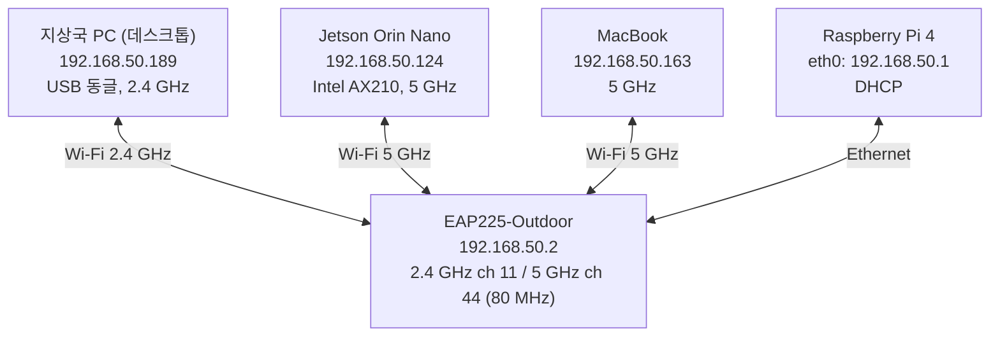

# 측정 기록 · 2026-10-05 — 지상국 PC ↔ Jetson 지연

지상국 PC에서 Jetson으로 가는 ping이 느리고 들쭉날쭉해서 원인을 찾고 고친 기록입니다. 17:05 ~ 22:30 사이에 쟀고, 숫자는 전부 원본 ping 기록에서 다시 계산했습니다.

> SSID와 IP는 [README](../../README.md)와 마찬가지로 측정 당시 내 환경의 값입니다. 계정 이름과 MAC 주소는 뺐습니다.

## 1. 요약

- **원인 두 가지, 둘 다 고쳤습니다.**
  1. Jetson Wi-Fi **절전이 켜져 있었습니다.** 절전을 끄려고 넣어 둔 NetworkManager 전역 설정 파일이 이름순 때문에 한 번도 적용되지 않았습니다.
  2. Jetson에 **GNOME 설정 앱의 Wi-Fi 화면이 열려 있어서** 15초마다 Wi-Fi 전체 스캔을 했습니다.
- **결과**: 지상국 PC → Jetson ping 중앙값 52.1 → **4.0 ms**, 최대 302 → **12.4 ms**, 50 ms 넘는 ping 76회 → **0회**.
- **전파는 원인이 아니었습니다.** 모든 단말이 -32 ~ -47 dBm이고 각자 규격의 최고 속도로 붙어 있었습니다.
- **남은 관찰**: Jetson의 송신 쪽이 수신 쪽보다 15 dB 약합니다. 지금은 영향이 없지만 거리가 멀어지면 이쪽이 먼저 약해집니다.

## 2. 측정 당시 구성



| 장비 | 주소 | 비고 |
| --- | --- | --- |
| EAP225-Outdoor | `192.168.50.2` | 2.4 GHz SSID 11채널, 5 GHz SSID 44채널(80 MHz). 송신 22 dBm. 펌웨어 5.2.4 |
| Raspberry Pi 4 | `192.168.50.1` | `eth0`로 EAP에 연결. dnsmasq DHCP. Wi-Fi(`wlan0`) 꺼짐, 기본 경로 없음 |
| Jetson Orin Nano | `192.168.50.124` | 5 GHz SSID. Intel AX210 (iwlwifi) |
| 지상국 PC | `192.168.50.189` | 2.4 GHz SSID. USB 동글 TL-WN823N (RTL8192EU, 2.4 GHz 전용) |
| MacBook | `192.168.50.163` | 5 GHz SSID |

이날 Jetson은 DHCP로 `.124`를 받아 쓰고 있었습니다. README의 설계값(`.10` 고정)과 다릅니다.

## 3. 측정 방법

| 측정 | 방법 |
| --- | --- |
| 지연 | 지상국 PC에서 `ping -D -i 0.2` (0.2초 간격). Pi와 Jetson을 **동시에** 재서 구간을 가름 |
| 스캔 | `iw event -t`로 `scan started` / `scan finished` 기록 (Jetson, 지상국 PC) |
| 절전 | `iw dev <if> get power_save`, `NetworkManager --print-config` (실제 적용값) |
| 단말 쪽 신호 | `iw dev <if> link`, `iw dev <if> station dump` (0.5초 간격 10회) |
| AP 쪽 신호 | EAP225 SSH → `enable` → `show station info`, `show wifi detail` |

지상국 PC → Pi는 `PC →(Wi-Fi)→ EAP →(유선)→ Pi`라서, 이 값이 정상이면 **PC 쪽 무선 구간은 정상**입니다. Jetson만 느리면 **EAP → Jetson 구간** 문제입니다.

## 4. 지연 — 전체 기록 (시간순)

단위 ms. 손실은 모든 측정에서 0.

| 시각 | 대상 | 조건 | 수신 | min | 중앙 | avg | p95 | p99 | max | >50 ms |
| --- | --- | --- | --- | ---: | ---: | ---: | ---: | ---: | ---: | ---: |
| 17:05 | Pi | ① 처음 상태 | 150/150 | 1.7 | 3.6 | 4.7 | 12.9 | 20.3 | 26.0 | 0 |
| 17:05 | **Jetson** | ① 처음 상태 (절전 on, 설정 앱 열림) | 150/150 | 2.8 | **52.1** | 55.9 | 123.0 | 292.0 | **302.0** | **76** |
| 17:07 | Jetson | ② Jetson 절전만 런타임으로 끔 | 150/150 | 3.3 | 6.3 | 16.5 | — | 122.0 | 127.0 | 15 |
| 17:08 | Jetson | ③ 절전 off 상태에서 스캔 관찰 | 180/180 | 3.2 | 6.2 | 9.4 | — | 81.4 | 112.0 | 4 |
| 17:09 | Jetson | ④ 절전 off + 설정 앱 일시정지 | 180/180 | 3.3 | 5.0 | 6.8 | — | 32.4 | 34.6 | 0 |
| 17:13 | Pi | ⑤ 전부 고친 뒤 | 300/300 | 1.6 | 3.4 | 4.4 | 10.2 | 20.7 | 33.0 | 0 |
| 17:13 | **Jetson** | ⑤ 전부 고친 뒤 | 300/300 | 2.6 | **4.8** | 5.6 | 10.6 | 16.8 | **34.8** | **0** |
| 22:21 | Pi | ⑥ 재확인 | 150/150 | 1.7 | 2.5 | 3.1 | 6.9 | 9.5 | 13.6 | 0 |
| 22:21 | **Jetson** | ⑥ 재확인 | 150/150 | 2.8 | **4.0** | 4.3 | 6.3 | 9.2 | **12.4** | **0** |

반대 방향(Jetson → Pi, 절전 on 상태, 100회)은 평균 5.5 ms, 최대 86.4 ms였습니다. Jetson이 **보낼 때는** 스스로 깨어 있어서 빠르고, **밖에서 들어올 때만** 느렸습니다.

### 처음 상태의 지연 패턴

① Jetson 측정의 앞부분 45개 (ms):

```
15 17 6 26 34 33 34 36 39 44 46 50 54 58 60 67 67 6 74 22 82 85 88 95 97 27 102 105 4 12 36 126 5 4 29 52 64 23 32 185 20 185 3 62 62
```

계단식으로 오르다 뚝 떨어지는 **톱니 모양**입니다. 절전 중인 단말은 비콘 주기(약 100 ms)마다만 깨어나고, 그사이 들어온 패킷은 AP가 붙잡고 있다가 깨어날 때 넘깁니다. ping을 보내는 시점과 깨어나는 시점이 조금씩 어긋나면서 이 모양이 나옵니다.

## 5. 스캔

| 시점 | 장비 | 관찰 시간 | 스캔 시작 | 비고 |
| --- | --- | --- | ---: | --- |
| 17:05 | 지상국 PC | 30초 | 0 | |
| 17:08 | **Jetson** | 40초 | **3** (15초 간격) | 한 번에 4~5초, 2.4·5·6 GHz 전 채널. 남은 튐과 시각이 겹침 |
| 17:09 | Jetson (설정 앱 일시정지) | 40초 | 0 | |
| 17:13 | Jetson / 지상국 PC | 60초 | 0 / 0 | 설정 앱을 닫은 뒤 |
| 22:21 | Jetson | 30초 | 0 | |

스캔을 요청한 것은 Jetson에 열려 있던 `gnome-control-center wifi`(설정 앱의 Wi-Fi 화면)입니다. 이 화면은 열려 있는 동안 주변 네트워크 목록을 갱신하려고 계속 스캔합니다.

## 6. 전파 세기

### 단말이 받은 AP 신호 (0.5초 간격 10회)

| 단말 | 신호 (dBm) | 평균 | 속도 |
| --- | --- | --- | --- |
| Jetson | -35 -37 -33 -33 -33 -33 -33 -33 -33 -33 | -32 dBm (비콘 -30) | 866.7 Mbps 양방향 — 5 GHz 80 MHz 2×2 최고 등급 (VHT MCS 9) |
| 지상국 PC | -32 × 10 | -32 dBm | 144.4 Mbps — 2.4 GHz 20 MHz 2×2 최고 등급 |

### AP가 받은 단말 신호 (EAP225 `show station info`)

| 단말 | 대역·채널 | AP가 받은 신호 | 속도 (AP→단말 / 단말→AP) | 연결 시간 |
| --- | --- | ---: | --- | --- |
| 지상국 PC | 2.4 GHz · 11 | -32 dBm | 144 / 143 Mbps | 5시간 19분 |
| Jetson | 5 GHz · 44 | **-47 dBm** | 866 / 866 Mbps | 5시간 33분 |
| MacBook | 5 GHz · 44 | -43 dBm | 866 / 650 Mbps | 1시간 11분 |

| 범위 | 의미 |
| --- | --- |
| -30 ~ -50 dBm | 최상 |
| -50 ~ -67 dBm | 양호 (실시간 통신 가능) |
| -67 ~ -70 dBm | 보통 |
| -70 dBm보다 약함 | 불안정 |

모든 값이 최상 구간이고 속도도 모두 각 규격의 최고치입니다. 전파가 약하면 속도가 먼저 떨어지는데 그런 흔적이 없습니다.

### Jetson 신호의 비대칭

| 방향 | 신호 |
| --- | ---: |
| AP → Jetson (Jetson이 받음) | -32 dBm |
| Jetson → AP (AP가 받음) | -47 dBm |

**15 dB 차이**가 납니다. 양쪽 송신 출력이 22 dBm으로 같으니 Jetson 안테나의 위치·방향(금속 프레임 안쪽, 케이블 상태 등)을 의심할 만합니다. 지상국 PC는 양방향 -32 dBm으로 대칭입니다. 지금은 양방향 최고 속도라 영향이 없지만, 로봇이 AP에서 멀어지면 **Jetson → AP 방향이 먼저 약해집니다.**

## 7. 무선 품질 지표

| 항목 | 값 | 해석 |
| --- | --- | --- |
| Jetson 재전송 | 3,201 / 3,900,482 패킷 = **0.08 %**, 실패 0 (연결 5시간 25분) | 간섭·충돌 거의 없음 |
| AP 잡음 | -95 dBm (두 대역) | Jetson 링크 신호 대 잡음비 약 48 dB |
| AP 과도 재전송 / 비콘 누락 | 0 / 0 | 정상 |
| AP 절전 | 꺼짐 | 정상 |
| AP가 받은 다른 망 프레임 | 2.4 GHz **208,000** / 5 GHz 12,667 | 2.4 GHz 11채널을 주변 망과 같이 씀. 로봇(5 GHz)은 무관 |
| AP 부하 | 0.03 (가동 8시간 30분) | 여유 |

채널 점유율은 EAP225 CLI에 명령이 없어서 못 봤습니다. 웹 관리 화면에서 볼 수 있습니다.

## 8. 원인

### 원인 1 — Jetson Wi-Fi 절전 (주원인)

NetworkManager는 `/etc/NetworkManager/conf.d/`의 파일을 **이름순으로 읽고 나중 파일이 이깁니다.**

```
99-gen2-wifi-powersave-off.conf    wifi.powersave = 2  (끄기, 직접 넣은 것)
default-wifi-powersave-on.conf     wifi.powersave = 3  (켜기, Ubuntu 패키지 파일)  ← 마지막에 읽혀 이김
```

숫자 `9`가 글자 `d`보다 앞입니다. 실제 적용값도 켜짐이었습니다.

```
$ NetworkManager --print-config | grep powersave
wifi.powersave=3
```

예전에 좋아졌던 건 그때 실행한 런타임 명령(`iw ... set power_save off`) 덕분이었고, 재부팅하면서 다시 켜졌습니다. 연결 프로필의 `802-11-wireless.powersave`는 `default`라서 이 전역값을 그대로 따랐습니다.
[full-setup.md](../full-setup.md) Step 5처럼 **연결 프로필에 `powersave 2`를 넣었다면** 이 문제는 생기지 않았습니다. 프로필 값이 전역 기본값보다 우선하기 때문입니다.

**검증**: 런타임으로 끄자 중앙값 52.1 → 6.3 ms, 최대 302 → 127 ms (표의 ① → ②).

### 원인 2 — 설정 앱 Wi-Fi 화면의 주기 스캔

절전을 끈 뒤에도 50 ms 넘는 ping이 15번 남았고, 그 시각이 15초 주기 스캔의 시작과 겹쳤습니다. 스캔하는 4~5초 동안 무선이 다른 채널로 가 있어서 패킷이 밀립니다.

**검증**: 설정 앱을 일시정지(`kill -STOP`)하자 40초간 스캔 0회, 최대 34.6 ms, 50 ms 초과 0회 (표의 ④).

### 지상국 PC도 같은 이름순 문제

```
default-wifi-powersave-off.conf   (끄기)
default-wifi-powersave-on.conf    (켜기)  ← "off" < "on"이라 나중에 읽혀 이김
```

지상국 PC의 동글도 절전이 켜져 있었습니다. PC → AP 구간은 이미 빨라서 주원인은 아니었지만 같이 고쳤습니다.

## 9. 조치

| 어디 | 무엇 | 연결 끊김 |
| --- | --- | --- |
| Jetson | `iw dev <if> set power_save off` (즉시 적용) | 없음 |
| Jetson | 전역 설정 파일을 `zz-gen2-wifi-powersave-off.conf`로 이름 바꿔 설치(패키지 파일보다 뒤에 읽힘), 옛 `99-` 파일 제거, `nmcli general reload conf` | 없음 |
| Jetson | 열려 있던 설정 앱 Wi-Fi 화면 닫음 | 없음 |
| 지상국 PC | 연결 프로필에 `802-11-wireless.powersave 2`를 넣고 재연결 | 몇 초 |

EAP225에서는 읽기 명령만 썼고 설정은 바꾸지 않았습니다.

## 10. 현재 상태 (22:21)

| 항목 | 값 |
| --- | --- |
| Jetson 실제 적용값 | `wifi.powersave=2` (꺼짐) |
| Jetson / 지상국 PC 절전 | off / off |
| Jetson 설정 앱 | 닫힘, 30초 스캔 0회 |
| 지상국 PC → Jetson | 중앙 4.0 ms, p95 6.3 ms, 최대 12.4 ms, 손실 0 |

재부팅해도 절전이 꺼진 채로 올라오도록 설정했지만 **실제 재부팅 시험은 하지 않았습니다.**

## 11. 남은 것

1. **Jetson 안테나 확인** — 송신이 15 dB 약합니다. 금속 프레임 안쪽에 있거나 케이블이 눌렸는지 봅니다.
2. **재부팅 후 확인** — `iw dev <if> get power_save`가 `off`인지.
3. **2.4 GHz는 붐빔** — 지상국 PC 동글이 2.4 GHz 전용이라 주변 망과 11채널을 나눠 씁니다. 5 GHz 동글로 바꾸면 더 안정적입니다.
4. **거리별 측정** — 이번 측정은 모두 AP 가까이에서 했습니다. [performance.md](../performance.md)의 거리별 표는 아직 비어 있습니다.
5. **처리량·UDP 지터·ROS 2 topic loss** — 이번에는 재지 않았습니다.

## 12. 다시 느려지면

1. Jetson·지상국 PC에 **설정 앱 Wi-Fi 화면이나 네트워크 선택 창이 열려 있는지** 봅니다. 쓰고 나면 닫습니다.
2. 스캔 확인: `iw event -t` — `scan started`가 주기적으로 찍히면 스캔이 원인입니다.
3. 절전 확인: `iw dev <if> get power_save`와 `NetworkManager --print-config | grep powersave` (실제 적용값)
4. 구간 가르기: Pi와 Jetson을 동시에 ping
   ```bash
   ping -D -i 0.2 -c 150 192.168.50.1 &
   ping -D -i 0.2 -c 150 192.168.50.124
   ```
   `-D`(시각 표시)는 iputils `ping`에 있는 옵션입니다. GNU inetutils `ping`에는 없으니 `/usr/bin/ping`을 직접 쓰세요.
5. AP 쪽 신호: EAP225에 관리자 계정으로 SSH → `enable` → `show station info`.
   명령을 한 줄로 실행하는 방식(`ssh host 'cmd'`)은 안 되고 대화형 화면만 됩니다. `show wifi detail` 출력에는 키 값이 섞이니 공유하지 마세요.

전역 conf.d 파일로 절전을 끌 때는 **이름이 패키지 파일(`default-…`)보다 뒤에 오는지** 확인하고, 반드시 `--print-config`로 실제 적용값을 보세요. 가장 확실한 방법은 연결 프로필에 `802-11-wireless.powersave 2`를 넣는 것입니다.
